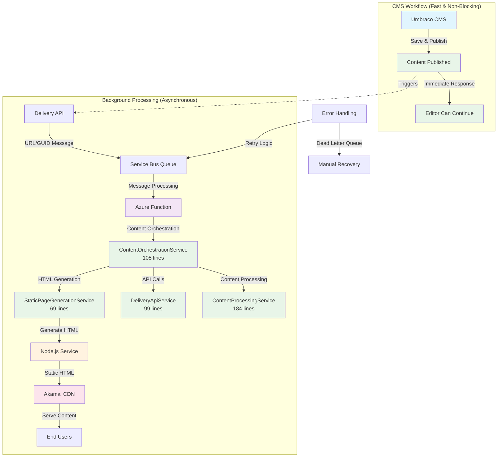
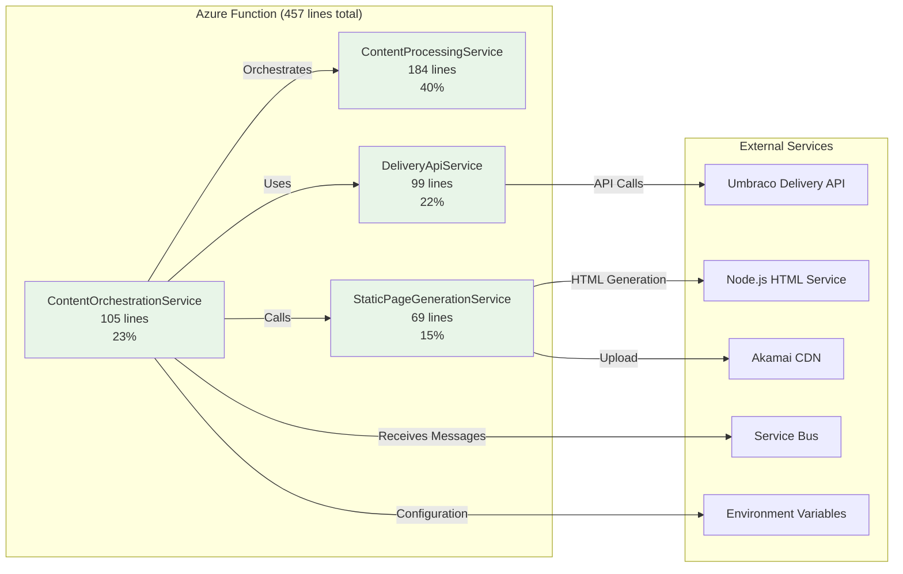
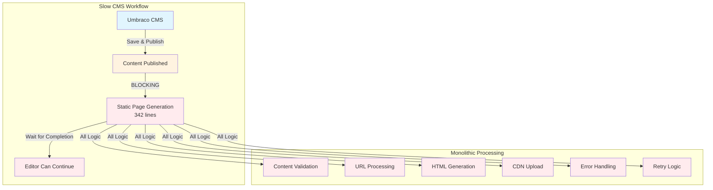
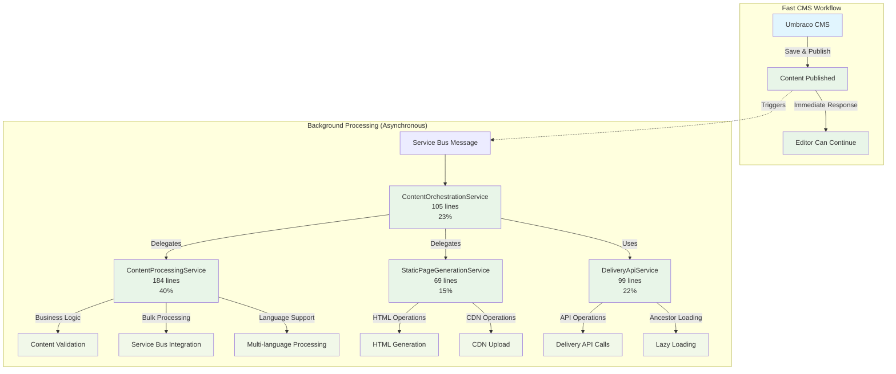
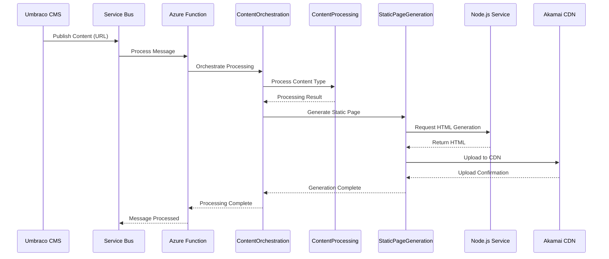
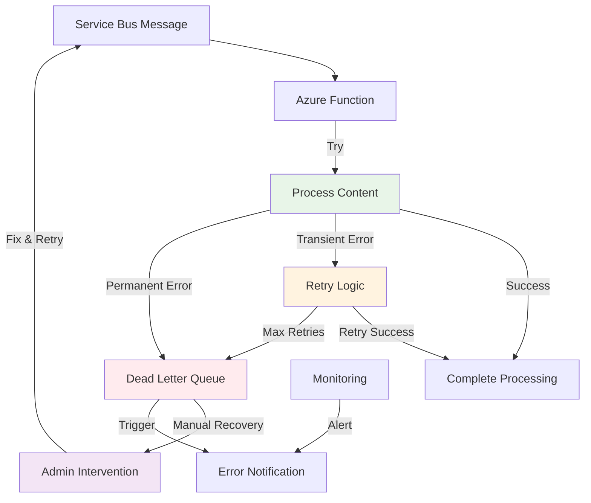
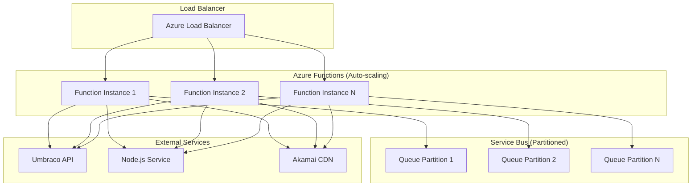

# 🏗️ **System Architecture Overview - Static Pages Refactoring**

## 📋 **Overview**
This document provides a comprehensive visual overview of the system architecture for the Static Pages Refactoring project, showing the complete flow from content management to static page delivery.

---

## 🔄 **Complete System Flow**

---

## 🎯 **Service Architecture Detail**

---

## 🔧 **Before vs After Architecture**

### **Before: Blocking Save & Publish**

### **After: Non-Blocking Save & Publish**

---

## 📊 **Performance Flow**

---

## 🛡️ **Error Handling Flow**

---

## 📈 **Scalability Architecture**

---

## 🎯 **Key Architecture Benefits**

### **1. Separation of Concerns**
- **ContentOrchestrationService**: Workflow coordination (105 lines, 23%)
- **ContentProcessingService**: Business logic (184 lines, 40%)
- **StaticPageGenerationService**: HTML operations (69 lines, 15%)
- **DeliveryApiService**: External API communication (99 lines, 22%)

### **2. Scalability**
- **Independent Scaling**: Each service scales independently
- **Load Distribution**: Workload distributed across instances
- **Resource Optimization**: Resources allocated based on need

### **3. Reliability**
- **Fault Isolation**: Service failures don't cascade
- **Error Handling**: Comprehensive retry and recovery
- **Monitoring**: Real-time health monitoring

### **4. Maintainability**
- **Clear Boundaries**: Well-defined service responsibilities
- **Easy Testing**: Independent service testing
- **Code Reusability**: Services can be reused

---

*This system architecture demonstrates advanced microservices design principles and provides a solid foundation for scalable, maintainable, and reliable static page generation.* 🏗️